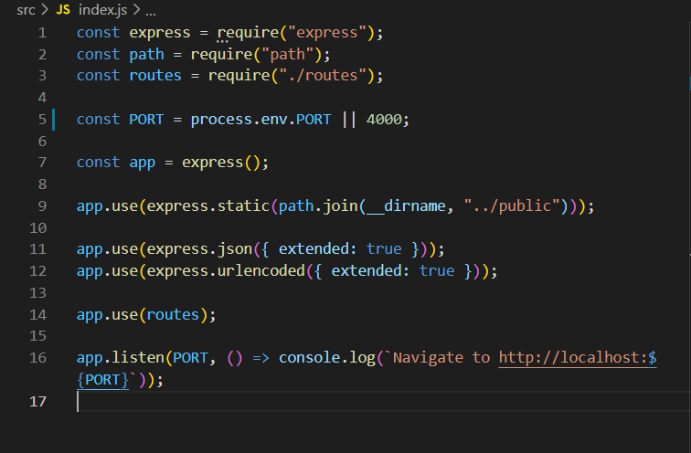
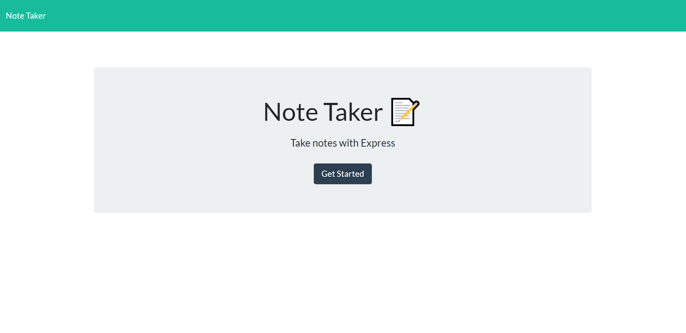
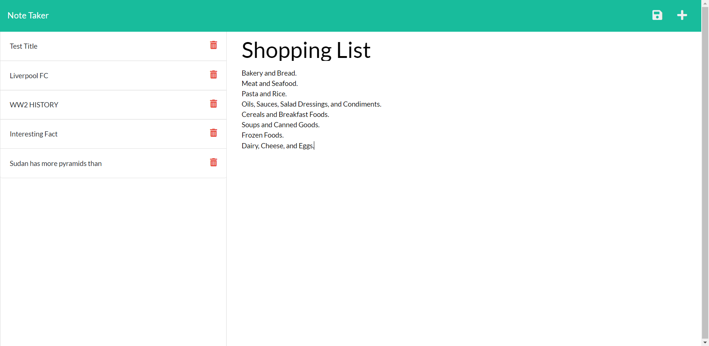

# NOTE-TAKER

## Description

This web application called Note-Taker can be used to write and save notes. his application will use an Express.js back end and will save and retrieve note data from a JSON file.

## Links

To see the full Deployed Heroku link <a href='https://drive.google.com/file/d/1wB6xwaIL2Ra1J6YIZxavdqfMgsExmtCN/view?usp=sharing'>click here </a>

## Video :

To see how the application works <a href='https://drive.google.com/file/d/1q_TScQRFzEW_PS5WdH32OBf1BJZ3ecrJ/view?usp=sharing'>click here </a>

## User Stories

```
AS A small business owner
I WANT to be able to write and save notes
SO THAT I can organize my thoughts and keep track of tasks I need to complete
```

## Acceptance Criteria

```
GIVEN a note-taking application
WHEN I open the Note Taker
THEN I am presented with a landing page with a link to a notes page
WHEN I click on the link to the notes page
THEN I am presented with a page with existing notes listed in the left-hand column, plus empty fields to enter a new note title and the note’s text in the right-hand column
WHEN I enter a new note title and the note’s text
THEN a Save icon appears in the navigation at the top of the page
WHEN I click on the Save icon
THEN the new note I have entered is saved and appears in the left-hand column with the other existing notes
WHEN I click on an existing note in the list in the left-hand column
THEN that note appears in the right-hand column
WHEN I click on the Write icon in the navigation at the top of the page
THEN I am presented with empty fields to enter a new note title and the note’s text in the right-hand column
```

## Tools/Technologies

- node.js
- express Js
- uuid
- nodemon
- JavaScript
- JQuery
- HTML
- CSS

## Endpoints

### Setting up the server

### api

- GET Method: This will return an array of note(s).

```
router.get("api/notes", getNotes);

router.get("api/notes/:id", getNoteById);

```

- POST Method: This will create and add a new note object to the array of notes

```
router.post("api/notes", addNote);

```

- Delete Method: This will delete a specific note based on the unique id

```
router.delete("api/notes/:id", deleteNote);

```

### See sample response:



#### GET request return:

```json
[
  {
    "id": "9ae32cd5-b2cc-44e0-b7b2-70289a8f586e",
    "title": "Interesting Fact",
    "text": "It was found in 2002, approximately 12 miles south of Ljubljana, the capital of Slovenia, and is now housed in the city’s museum. Radiocarbon dating was used to determine the wheel’s age, which is somewhere between 5,100 and 5,350 years old. Closer to home, these are the oldest tourist attractions in every state."
  },
  {
    "id": "2e10fb9c-0941-4207-9a64-cf0f5ef8bce7",
    "title": "Sudan has more pyramids than",
    "text": "Not only does Sudan have more pyramids than Egypt, but the numbers aren’t even close. While 138 pyramids have been discovered in Egypt, Sudan boasts around 255. Next, see if you can answer these real Jeopardy! questions about geography."
  }
]
```

#### POST body:

```json
{
  "title": "your title",
  "text": "your text"
}
```

## Screenshots



